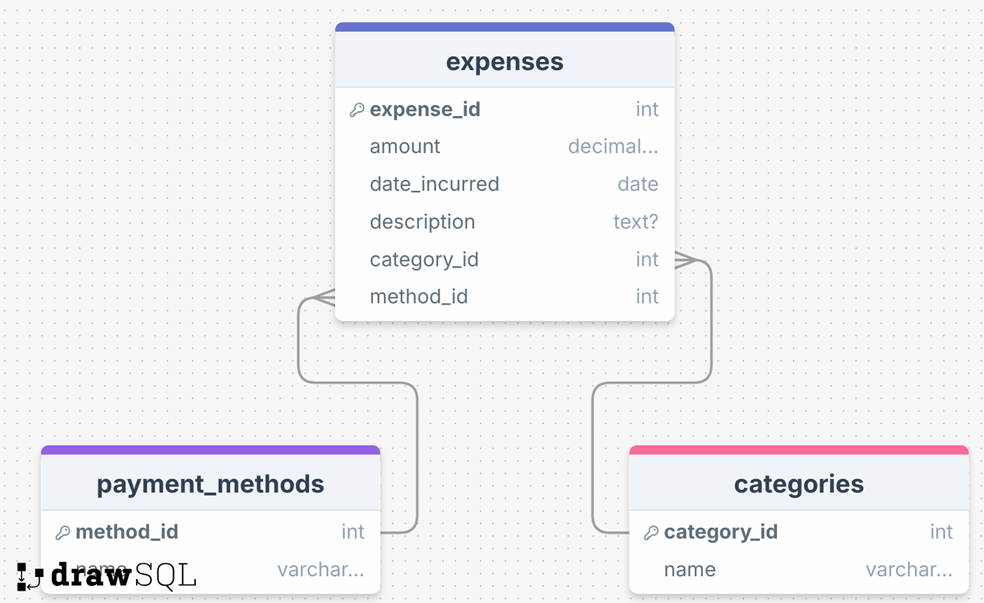

# AI_SQL

A natural language to SQL query system powered by OpenAI GPT, designed for intelligent database queries on personal expense tracking.

## Overview

AI_SQL enables users to ask questions in natural language and automatically converts them into SQL queries. The system returns database results and converts them back into friendly natural language responses.

## Database Schema

The system uses SQLite with three main tables:



**expenses** (expense records)
- `id` (INTEGER): Primary key
- `amount` (REAL): Expense amount
- `date_incurred` (TEXT): Date of expense
- `category` (TEXT): Expense category
- `method` (TEXT): Payment method

**categories** and **payment_methods** tables provide relational structure for better data organization.


## Running the Project

### Setup
```bash
# Set your OpenAI API key
export OPENAI_API_KEY="your_api_key_here"

# Run the application
python ai_sql.py
```

The program will:
1. Initialize the expense database (if not exists)
2. Accept natural language questions
3. Generate and execute SQL queries
4. Return natural language responses

## Examples

See [Sample.md](Sample.md) for detailed test cases and example queries:
- ✅ Total spending calculation
- ✅ Category-specific expenses
- ✅ Date range queries
- ✅ Transaction counting
- ✅ Comparative analysis

## References

- [Personal Expense Tracker Database.pdf](Personal%20Expense%20Tracker%20Database.pdf) - Detailed system design
- [Sample.md](Sample.md) - Test cases and results
